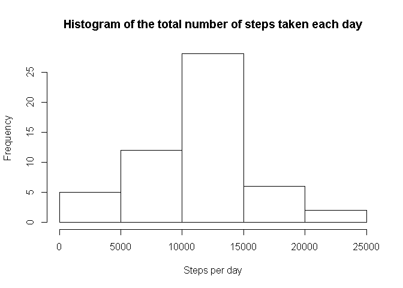
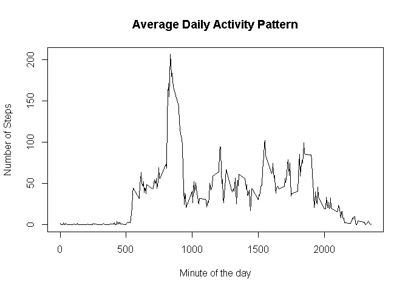
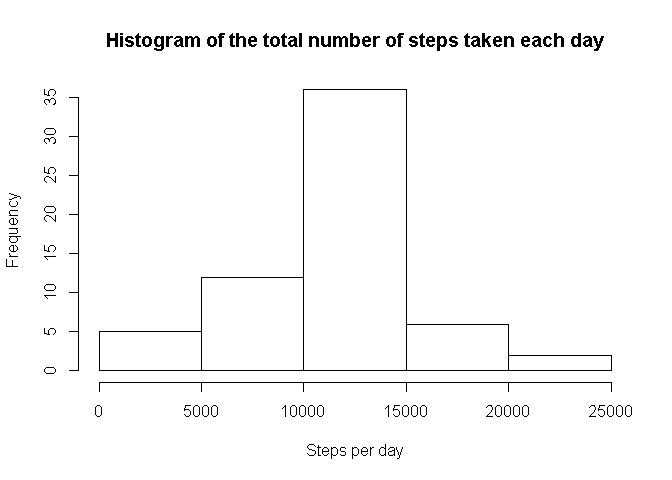
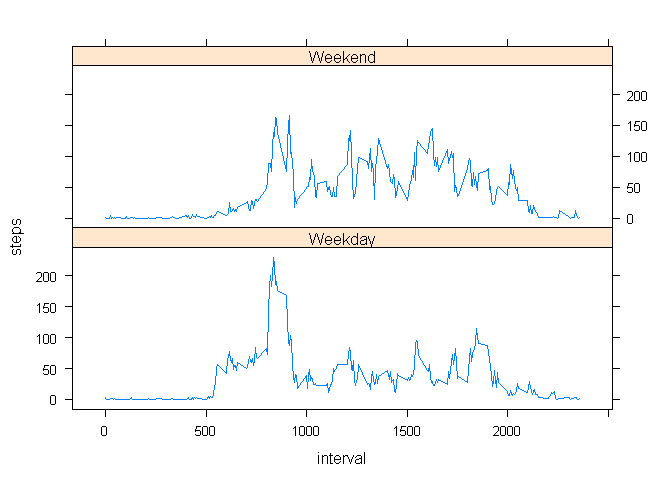

# Reproducible Research: Peer Assessment 1


## Loading and preprocessing the data


```r
myData<-read.csv("activity/activity.csv")
#Changing the data type of the date from character to date
myData$date <- as.Date(myData$date)
```

## What is mean total number of steps taken per day?


```r
#Ignoring the NA values in steps column.
myCompleteData<-myData[!is.na(myData$steps),]
dailyStepCount <- tapply(myCompleteData$steps,myCompleteData$date,sum)
hist(dailyStepCount, xlab="Steps per day",main="Histogram of the total number of steps taken each day")
```

 

Mean of the total number of steps taken per day:


```r
mean(dailyStepCount)
```

```
## [1] 10766.19
```

Median of the total number of steps taken per day:


```r
median(dailyStepCount)
```

```
## [1] 10765
```

## What is the average daily activity pattern?


```r
averagePattern<- tapply(myCompleteData$steps,myCompleteData$interval,mean)
plot(names(averagePattern),averagePattern, type="l", ylab="Number of Steps",    xlab="Minute of the day", main="Average Daily Activity Pattern")
```

 

The 5-minute interval that contains the maximum number of steps on average across all the days in the dataset is calculated below:


```r
names(which.max(averagePattern))
```

```
## [1] "835"
```

## Imputing missing values

Total Number of missing values in the steps column of the dataset is calculated below:


```r
sum(is.na(myData$steps))
```

```
## [1] 2304
```

Replacing missing step values with the mean value for that 5 minute interval.


```r
for (i in 1:nrow(myData)){
  if(is.na(myData[i,]$steps)){
    myData[i,]$steps<-averagePattern[as.character(myData[i,]$interval)]
  }
}
```

Histogram after replacing the missing values:


```r
newDailyStepCount <- tapply(myData$steps,myData$date,sum)
hist(newDailyStepCount, xlab="Steps per day",main="Histogram of the total number of steps taken each day")
```

 

Mean of the total number of steps taken per day after replacing the missing values:


```r
mean(newDailyStepCount)
```

```
## [1] 10766.19
```

Median of the total number of steps taken per day after replacing the missing values:


```r
median(newDailyStepCount)
```

```
## [1] 10766.19
```

After replacing the missing values with the average values for the corresponding 5 minute interval, the mean has remained same and the median has changed to become same as the mean.

## Are there differences in activity patterns between weekdays and weekends?


```r
#Adding a day type column to the data frame to identify whether the day was a weekday or weekend

#Default value is weekday
myData$dayType <- c("Weekday")

myData[(as.POSIXlt(myData$date)$wday==0) | (as.POSIXlt(myData$date)$wday==6),]$dayType <- "Weekend"

#calculating Weekday Average Pattern
weekdayAveragePattern <- tapply(myData[myData$dayType=="Weekday",]$steps,myData[myData$dayType == "Weekday",]$interval,mean)

#calculating Weekend Average Pattern
weekendAveragePattern <- tapply(myData[myData$dayType=="Weekend",]$steps,myData[myData$dayType == "Weekend",]$interval,mean)

#plotting weekend and weekday average patterns

library(lattice)
t1<-data.frame(as.numeric(names(weekdayAveragePattern)),weekdayAveragePattern,"Weekday")
t2<-data.frame(as.numeric(names(weekendAveragePattern)),weekendAveragePattern,"Weekend")
colnames(t1)<-c("interval","steps","daytype")
colnames(t2)<-c("interval","steps","daytype")
t3<-rbind(t1,t2)
xyplot(steps~interval|factor(daytype),t3,layout=c(1,2), type="l")
```

 

The user seems to be active more often during the weekends than on the weekdays. 
